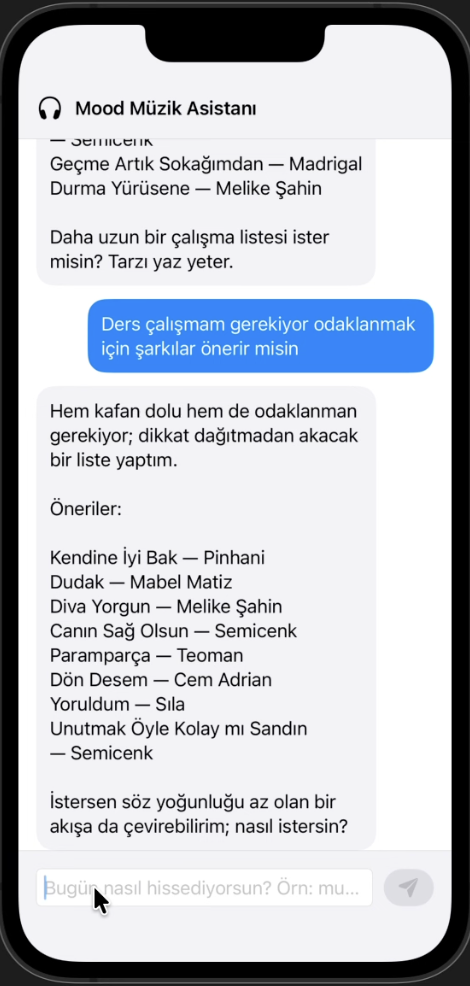
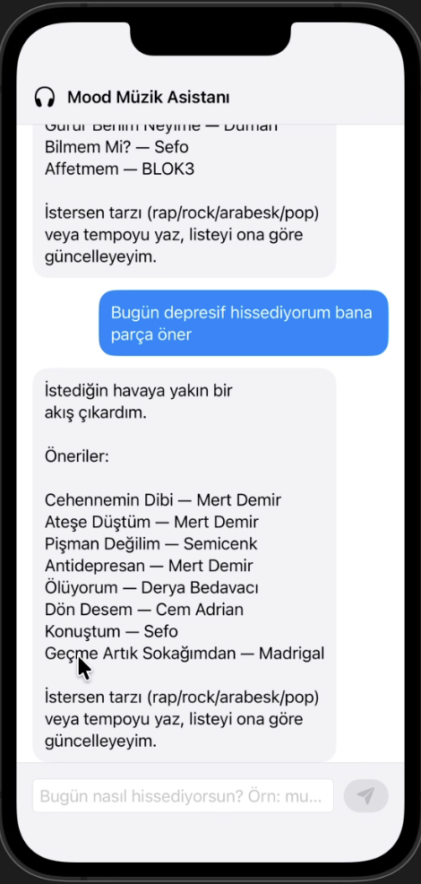

# 🎵 Mood Music AI


**Mood Music AI** is an intelligent iOS application designed to recommend music based on the user's emotional state. By leveraging advanced machine learning techniques like **Retrieval-Augmented Generation (RAG)** and **Fine-Tuning**, the app analyzes user input to generate personalized, context-aware music suggestions.

## 🚀 Features

* **Mood Analysis:** Uses Natural Language Processing (NLP) to understand the user's current mood from text input.
* **Smart Recommendations:** Implements RAG to retrieve relevant music data and generate suggestions that fit the context.
* **Interactive Chatbot:** A native iOS interface built with **SwiftUI** for seamless user interaction.
* **Model Training:** Includes a Jupyter Notebook demonstrating the model fine-tuning and data processing steps.

## 🛠 Tech Stack

### iOS Client
* **Language:** Swift
* **UI Framework:** SwiftUI
* **IDE:** Xcode

### Artificial Intelligence & Backend
* **Model Techniques:** RAG (Retrieval-Augmented Generation), LLM Fine-tuning
* **Development:** Python, Jupyter Notebook
* **Data Processing:** Pandas, NumPy (add others if used like PyTorch/TensorFlow)

## 📂 Project Structure

* `MoodMusicChatbotApp.swift`: The entry point for the iOS application.
* `Mood Music AI/`: Contains the source code for the iOS app views and logic.
* `222805010_Bekir_Gumus.ipynb`: The Jupyter Notebook containing the AI model training, fine-tuning processes, and RAG implementation logic.

## 📱 Screenshots

| Home Screen | Chat Interface | Recommendation |
|:---:|:---:|:---:|
|  |  |  |

*(Note: Please update image placeholders with actual screenshots of your app)*

## ⚙️ Installation & Usage

1.  **Clone the repo:**
    ```bash
    git clone [https://github.com/bkrgms/Mood-Music-AI.git](https://github.com/bkrgms/Mood-Music-AI.git)
    ```
2.  **Open the iOS Project:**
    * Navigate to the folder and open `MoodMusicAI.xcodeproj` in Xcode.
    * Build and run on a simulator or physical device.
3.  **Inspect the AI Model:**
    * Open the `.ipynb` file using Jupyter Notebook or Google Colab to see the underlying AI logic and training process.

## 👤 Author

**Bekir Gümüş**
* LinkedIn: [bekir-gumus](https://www.linkedin.com/in/bekir-gumus/)
* GitHub: [@bkrgms](https://github.com/bkrgms)

---
*⭐️ If you like this project, please give it a star!*

